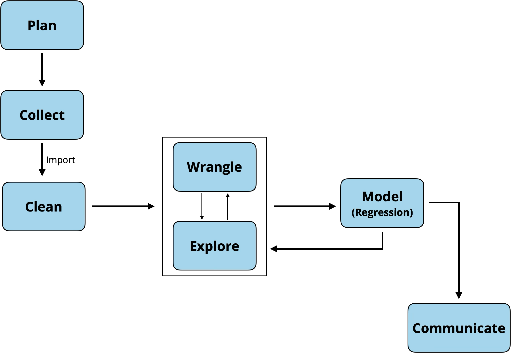
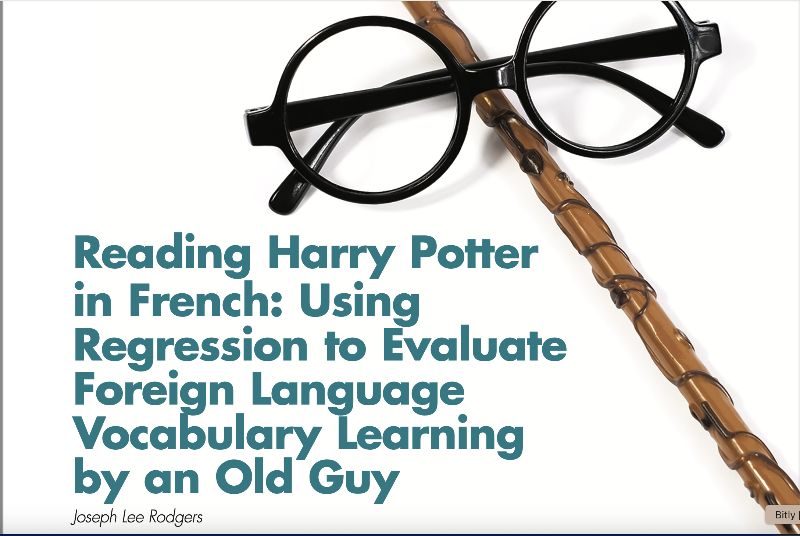
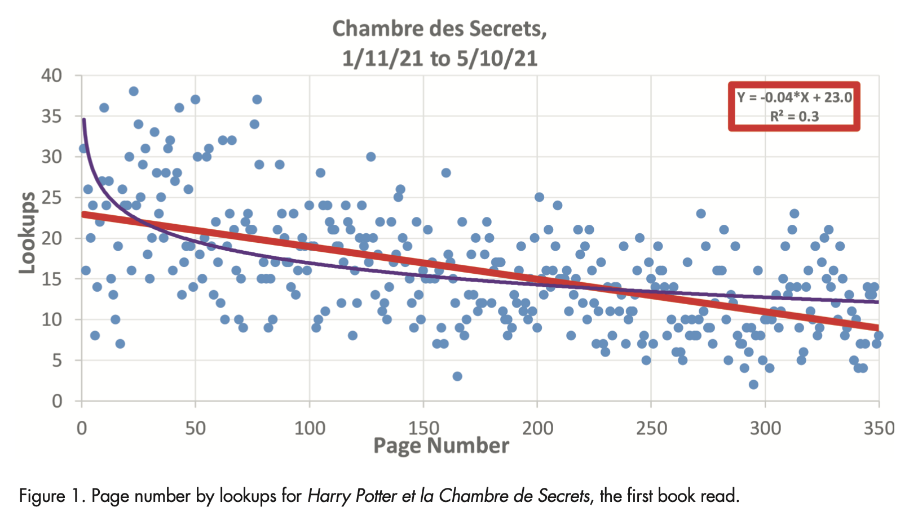
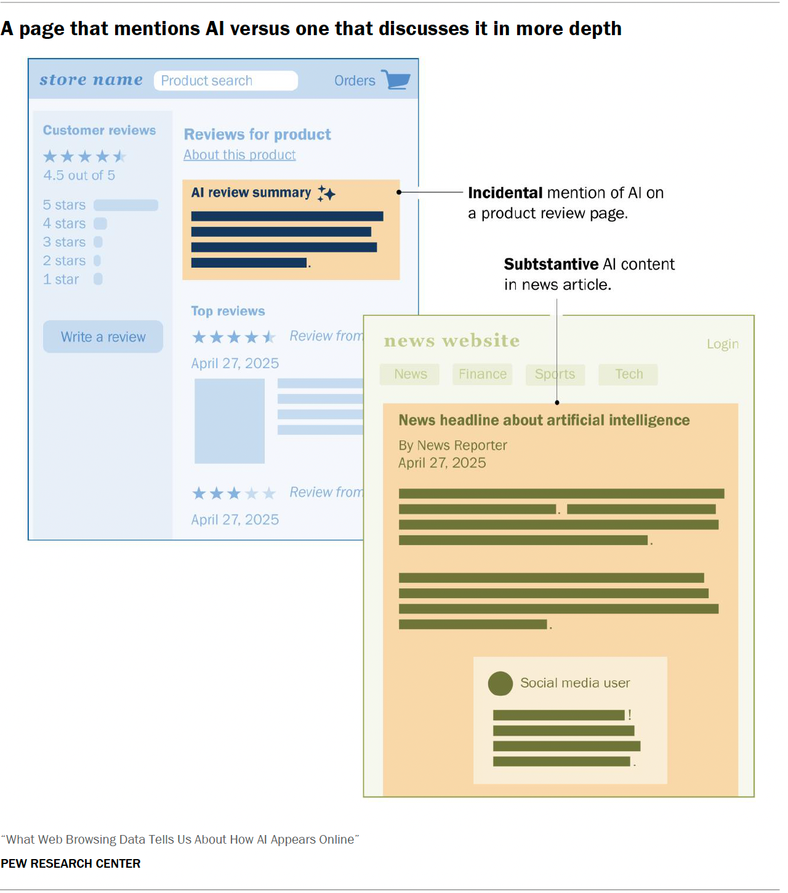
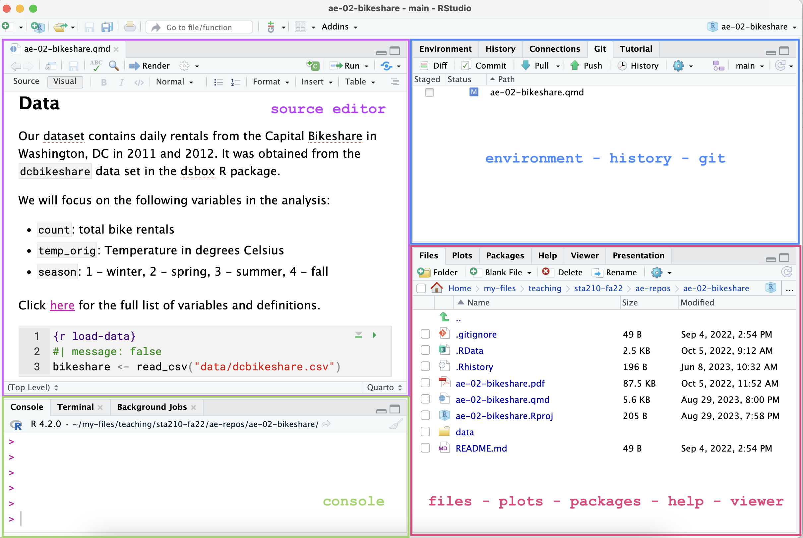
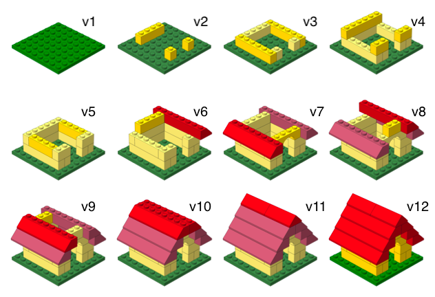

# Welcome!

## Meet Prof. Tackett! {.midi}

::: incremental
- Education and career journey
  - BS in Math and MS in Statistics from University of Tennessee
  - Statistician at Capital One
  - PhD in Statistics from University of Virginia
  - Director of Undergraduate Studies and Associate Professor of the Practice (Office: Old Chem 118B)
- Work focuses on statistics education and inclusive teaching practices
- Co-leader of the Bass Connections team Mental Health and the Justice System in Durham County
- Mom of 3.5-year-old twins 🙂 (and one grumpy cat)
:::

------------------------------------------------------------------------

## Teaching Assistants

**Lab 01**

- Shane Rybacki (PhD)

- Ishrit Gupta (UG)

**Lab 02**

- Franklin Zhou (MS)

- Arnav Meduri (UG)

## Introduce yourself

::: question
Find 1–2 people near you and introduce yourselves.

- Year in school

- Where you're from

- What you're reading, watching, or listening to right now

**Bonus**: Find one thing you have in common (besides being Duke students!)
:::

## Topics

- Introduction to the course

- Syllabus activity

- Reproducibility

# Introduction to STA 221

## Data science workflow

{fig-align="center" width="80%"}

## Your turn!

::: question
What word or phrase comes to mind when you hear the terms "regression analysis" or "regression models"?
:::

{fig-align="center" width="40%"}

<https://app.wooclap.com/YYUCQAC>

## What is regression analysis?

::: {}
> *In [statistical modeling](https://en.wikipedia.org/wiki/Statistical_model "Statistical model"), **regression analysis** is a statistical method for [estimating](https://en.wikipedia.org/wiki/Estimation_theory "Estimation theory") the relationship between a [dependent variable](https://en.wikipedia.org/wiki/Dependent_variable "Dependent variable") (often called the outcome or response variable, or a label in machine learning parlance) and one or more [independent variables](https://en.wikipedia.org/wiki/Independent_variable "Independent variable") (often called regressors, predictors, covariates, explanatory variables or features).^[\[1\]](https://en.wikipedia.org/wiki/Regression_analysis#cite_note-1)[\[2\]](https://en.wikipedia.org/wiki/Regression_analysis#cite_note-2)^*

Source: Wikipedia (January 2026)
:::

## Linear regression in practice

{fig-align="center" width="60%"}

::: aside
[Rodgers, J. L. (2024). Reading Harry Potter in French: Using Regression to Evaluate Foreign Language Vocabulary Learning by an Old Guy. CHANCE, 37(3), 13–21.](https://canvas.duke.edu/courses/84458/files/folder/Readings?preview=5310877)
:::

## Example: Reading Harry Potter

{fig-align="center" width="65%"}

$$\text{Lookups} = 23.0 - 0.04 \times \text{Page Number}$$

::: aside
[Rodgers, J. L. (2024). Reading Harry Potter in French: Using Regression to Evaluate Foreign Language Vocabulary Learning by an Old Guy. CHANCE, 37(3), 13–21.](https://canvas.duke.edu/courses/73984/files?preview=4295020)
:::

## Example: Reading Harry Potter

$$\text{Lookups} = \beta_0 + \beta_1 ~ \text{Page Number} + \epsilon$$

 

. . .

$$\begin{bmatrix}
y_1 \\
y_2 \\
\vdots \\
y_n
\end{bmatrix} = 
\begin{bmatrix}
1 & x_1 \\
1 & x_2 \\
\vdots & \vdots \\
1 & x_n
\end{bmatrix}
\begin{bmatrix}
\beta_0 \\
\beta_1 \\
\end{bmatrix} +  \begin{bmatrix}
\epsilon_1 \\
\epsilon_2 \\
\vdots \\
\epsilon_n
\end{bmatrix}$$

## Logistic regression in practice

Pew Research Center conducted the 2025 [What Web Browsing Data Tells Us About How AI Appears Online](https://www.pewresearch.org/data-labs/2025/05/23/what-web-browsing-data-tells-us-about-how-ai-appears-online/).

](images/clipboard-93809062.png){fig-align="center" width="40%"}

:::: aside
::: small
[Chapekis, A., Lieb, A., Shah, S., Smith, A. (2025) What Web Browsing Data Tells Us about How AI Appears Online. Pew Research Center.https://www.pewresearch.org/data-labs/2025/05/23/what-web-browsing-data-tells-us-about-how-ai-appears-online/](https://www.pewresearch.org/data-labs/2025/05/23/what-web-browsing-data-tells-us-about-how-ai-appears-online/)
:::
::::

## Example: AI mentions

Researchers used logistic regression to classify online articles in which AI was a central focus versus an incidental mention.

::::: columns
::: {.column width="70%"}
{fig-align="center" width="50%"}
:::

::: {.column width="30%"}
$$\log\Big(\frac{\pi}{1-\pi}\Big) = \mathbf{X}\boldsymbol{\beta}$$
:::
:::::

# STA 221

## What is STA 221?

{fig-alt="Application plus theory" fig-align="center"}

 

**Prerequisites:** Introductory statistics or probability [**and**]{.underline} linear algebra

**Recommended corequisite:** Probability

## Course learning objectives {.midi}

By the end of the semester, you will be able to...

- analyze data to explore real-world multivariable relationships.
- fit, interpret, and draw conclusions from linear and logistic regression models.
- implement a reproducible analysis workflow using R for analysis, Quarto to write reports and GitHub for version control and collaboration.
- explain the mathematical foundations of linear and logistic regression.
- effectively communicate statistical results to a general audience.
- assess the ethical considerations and implications of analysis decisions.

## Course topics {.small}

::::::::: columns
:::: {.column width="48%"}
::: {.fragment fragment-index="1"}
### Linear regression {style="color: #993399"}

- Coefficient estimation and interpretation
- Prediction
- Model evaluation
- Matrix representation of regression
- Model conditions and diagnostics
- Model selection
- Types of predictors
- Properties of estimators
:::
::::

:::::: {.column width="48%"}
::: {.fragment fragment-index="2"}
### Logistic regression {style="color: #993399"}

- Coefficient estimation and interpretation
- Prediction
- Model evaluation
- Inference
:::

::: {.fragment fragment-index="3"}
### Special topics {style="color: #993399"}

 
:::

::: {.fragment fragment-index="4"}
### General topics {style="color: #993399"}

- Computing using R and GitHub
- Presenting statistical results
- Collaboration and teamwork
- Ethics
:::
::::::
:::::::::

# Course overview

## Course toolkit

- **Website**: <https://sta221-fa26.github.io>
  - Central hub for the course!

  - **Tour of the website**
- **Canvas**: <https://canvas.duke.edu/courses/84458>
  - Gradebook
  - Office hours
  - Announcements
  - Gradescope
  - Ed Discussion (Class discussion forum)

## Course toolkit

- **GitHub:** <https://github.com/sta221-fa26>
  - Distribute assignments

  - Platform for version control and collaboration
- **Textbook:** *Introduction to Regression Analysis: A Data Science Approach*
  - <https://intro-regression.github.io>

## Computing toolkit {.midi}

::::::::: columns
::::: {.column width="50%"}
::: {.fragment fragment-index="1"}
{fig-alt="RStudio logo" fig-align="center" width="5.61in" height="1.6in"}
:::

::: {.fragment fragment-index="2"}
- All analyses using R, a statistical programming language

- Write reproducible reports in Quarto

- Access RStudio through [STA 221 Docker Containers](https://cmgr.oit.duke.edu/containers)
:::
:::::

::::: {.column width="50%"}
::: {.fragment fragment-index="1"}
{fig-alt="GitHub logo" fig-align="center" width="5.61in" height="1.6in"}
:::

::: {.fragment fragment-index="3"}
- Access assignments

- Facilitates version control and collaboration

- All work in [STA 221 course organization](https://github.com/sta221-fa26)
:::
:::::
:::::::::

## Participation (5%)

::: incremental
- Get the most out of lecture by completing prepare reading before class, attending lecture, and actively participating

- Participation tracked via poll question(s) in each lecture

  - Graded for completion, not correctness

  - *Complete poll in 18 out of 26 lectures for full credit in the final course grade*

- Be prepared to take handwritten notes during lecture. There will also be periodic hands-on computing exercises.

- May [request lecture recording](https://sta221-fa26.github.io/syllabus.html#lecture-recording-request) for excused absences
:::

## Labs (10%)

::: incremental
- Complete hands-on data analysis exercises focused on computing and communication.

- Work on labs in teams and each student will submit lab individually

- Labs graded based on attendance, submitting the lab on time, and correctness on two randomly selected exercises.

- Labs are due at the end of class. There is no late work or make ups.

  - *Two lowest lab grades dropped at the end of the semester.*
:::

## Homework (10%) {.midi}

::: incremental
- Use what you've learned in lecture and lab to complete applied data analysis exercises and conceptual exercises focused on mathematical derivations

- Homework graded based on correctness for one randomly selected conceptual exercise, one randomly selected analysis exercise, and workflow

  - *Lowest homework dropped at the end of the semester*

- Homework may be submitted up to two days late with late deduction

  - [One-time waiver](https://sta221-fa26.github.io/syllabus.html#one-time-late-waiver) to submit a homework late with no deduction

- One homework is the *Statistics Experience* - do something related to statistics/ data science outside of the classroom
:::

## Exams (20% each)

::: incremental
- Two in-class midterm exams  + one in-class final exam

- Exams are a combination of multiple choice, true/false, short answer, and derivations

  - Some questions based on homework and labs

- No make-up exams. Final exam grade used to replaced mid-term exam missed due to reason documented by Dean's Excuse
:::

## Final project (15%)

::: incremental
- Work in teams to apply what you've learned in the course to analyze a research question of your choice

- Project will start around Week 5 of the semester with periodic milestones throughout the semester

- Final deliverables: Write up + presentation
:::

## Grading

| Category      | Percentage |
|---------------|------------|
| Participation | 5%         |
| Homework      | 10%        |
| Labs          | 10%        |
| Final project | 15%        |
| Exam 01       | 20%        |
| Exam 02       | 20%        |
| Final exam    | 20%        |

## AI in this course

**Guiding principles for working with AI\*:**

- **Cognitive dimension:** Working with AI should not reduce your ability to think clearly.

- **Ethical dimension:** Students using AI should be transparent about their use and make sure it aligns with academic integrity policy

::: aside
\*From *P[olicies related to ChatGPT and other AI Tools](https://docs.google.com/document/d/1WpCeTyiWCPQ9MNCsFeKMDQLSTsg1oKfNIH6MzoSFXqQ/preview?tab=t.0#heading=h.q2sz3kbqy68j)* by Joel Gladd, Ph.D
:::

## AI in this course

**Using AI in this course:**

- ✅ AI tools for code with attribution for substantial AI generated code
- ✅ AI tools for editing
- ✅ AI tools for learning
- ❌ No AI tools for narrative or derivations:
- ❌ No AI tools for in-class work

## Classroom community

::: small
It is my intent that students from all diverse backgrounds and perspectives be well-served by this course, that students' learning needs be addressed both in and out of class, and that the diversity that the students bring to this class be viewed as a resource, strength and benefit.

- If you have a name that differs from those that appear in your official Duke records, please let me know.

- Please let me know your preferred pronouns, if you are comfortable sharing.

- If you feel like your performance in the class is being impacted by your experiences outside of class, please don't hesitate to come and talk with me. If you prefer to speak with someone outside of the course, your advisers and deans are excellent resources.

- I (like many people) am still in the process of learning about diverse perspectives and identities. If something was said or done in class (by anyone) that made you feel uncomfortable, please talk to me about it.
:::

## Accessibility

- The [Student Disability Access Office (SDAO)](https://access.duke.edu/students) is available to ensure that students are able to engage with their courses and related assignments.

- If you have documented accommodations from SDAO, please send the documentation as soon as possible.

- I am committed to making all course activities and materials accessible. If any course component is not accessible to you in any way, please don't hesitate to let me know.

## Your turn!

::: question
What has helped you succeed in previous math and statistics courses?
:::

{fig-align="center" width="40%"}

<https://app.wooclap.com/YYUCQAC>

## Five tips for success in STA 221

1.  Complete all prepare readings and tasks before class.

2.  Actively participate and engage in lectures and labs.

3.  Ask questions frequently during lecture, in office hours, on Ed Discussion, and among your classmates.

4.  Complete all homework and labs, asking yourself “why” questions as you go through the steps to complete each exercise.

5.  Stay current with the course material, as each new concept builds on previous ones.

# Questions about the course?

# Toolkit for a reproducible workflow

## Reproducibility checklist

::: question
What does it mean for an analysis to be reproducible?
:::

. . .

**Near term goals**:

✔️ Can the tables and figures be exactly reproduced from the code and data?

✔️ Does the code actually do what you think it does?

✔️ In addition to what was done, is it clear *why* it was done?

. . .

**Long term goals**:

✔️ Can the code be used for other data?

✔️ Can you extend the code to do other things?

## Why is reproducibility important?

- Results produced are more reliable and trustworthy\*

- Facilitates more effective collaboration\*

- Contributing to science, which builds and organizes knowledge in terms of testable hypotheses\*\*

- Possible to identify and correct errors or biases in the analysis process\*\*

::: aside
\* @ostblom2022

\*\* @alexander2023
:::

## Toolkit

- **Scriptability** $\rightarrow$ R

- **Literate programming** (code, narrative, output in one place) $\rightarrow$ Quarto

- **Version control** $\rightarrow$ Git / GitHub

## R and RStudio

- R is a statistical programming language

- RStudio is a convenient interface for R (an integrated development environment, IDE)

](images/01/r_vs_rstudio_1.png){fig-align="center"}

------------------------------------------------------------------------

## RStudio IDE

{fig-align="center"}

## Quarto

- Fully reproducible reports -- the analysis is run from the beginning each time you render

- Code goes in chunks and narrative goes outside of chunks

- Visual editor to make document editing experience similar to a word processor (Google docs, Word, Pages, etc.)

## Quarto

{fig-align="center"}

## How will we use Quarto?

- Every application exercise and assignment is written in a Quarto document

- You'll have a template Quarto document to start with

- The amount of scaffolding in the template will decrease over the semester

# Version control with git and GitHub

## What is versioning?

 

{fig-align="center"}

------------------------------------------------------------------------

## What is versioning?

with human readable messages

{fig-align="center"}

------------------------------------------------------------------------

## Why do we need version control?

::::: columns
::: {.column width="50%"}
{fig-align="center"}
:::

::: {.column width="50%"}
Provides a clear record of how the analysis methods evolved. This makes analysis auditable and thus more trustworthy and reliable. [@ostblom2022]
:::
:::::

## git and GitHub

{fig-align="center"}

- **git** is a version control system -- like "Track Changes" features from Microsoft Word.
- **GitHub** is the home for your git-based projects on the internet (like DropBox but much better).
- There are a lot of git commands and very few people know them all. 99% of the time you will use git to add, commit, push, and pull.

## Before next class

- Complete [Lecture 02 Prepare](../prepare/prepare-lec02.html)

- Review [syllabus](https://sta221-fa26.github.io/syllabus)

- Accept GitHub invite (check your email or see the invite at <https://github.com/sta221-fa26>)

- Complete [Lab 00](../labs/lab-00.html) (if you haven't already)

- Office hours start Monday, August 31 (see schedule on Canvas homepage)

  - Please let me know if you need to schedule at time to meet this week

## References
