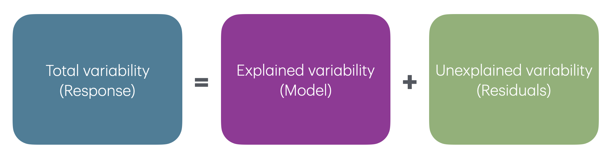

```{r setup}
#| include: false

library(countdown)

knitr::opts_chunk$set(
  fig.width = 8,
  fig.asp = 0.618,
  fig.retina = 3,
  dpi = 300,
  out.width = "80%",
  fig.align = "center"
)
```

## Announcements {.midi}

- Office hours start this week
  - See Canvas for schedule
- Matrix representation of regression on Thursday
  - See [Lecture 04 prepare](../prepare/prepare-lec04.html) for linear algebra resources

## Lab 01

- The TAs let me know that some groups did not finish the lab; we will take this into account when grading this lab.

- You must attend the lab section you're enrolled in. Beginning with Lab 02, you will not receive credit if you attend a different lab section (unless previously discussed with Prof. Tackett)

- Lab 01 Key posted in Canvas

- **Any questions about the lab?**

# GitHub questionnaire {.midi}

## GitHub questionnaire

Researchers from ETH Zurich are testing an instrument to measure students' understanding of git. They have validated the instrument and are doing wider classroom testing.

Please take a few minutes to take the questionnaire.

🔗 <https://descil.eu.qualtrics.com/jfe/form/SV_009i9vNAXthu4m2?sr=Tm2s>

If you finish early, clone the **ae-01** and work on Part 1 of the application exercise.

## GitHub questionnaire

- This is completely voluntary and your answers do not count for a grade.
- Give your best effort.
- Not knowing the answer is totally fine (it is likely you will not know the answer to some questions). If you are unsure, choose the answer that seems the most convincing.
- Even if you do not consent for your responses to be used for research, please take the questionnaire. I will receive the anonymous responses to help inform the computing in this course.

# Application exercise

::: appex
📋 [sta221-fa26.github.io/ae/ae-01-model-evaluation.html](../ae/ae-01-model-evaluation.html)

Complete Part 1.
:::

## Topics

- Use R to conduct exploratory data analysis and fit a model
- Evaluate models using RMSE and $R^2$
- Use analysis of variance to partition variability in the response variable

## Computing set up

```{r packages}
#| echo: true
#| message: false

# load packages
library(tidyverse)   # for data wrangling and visualization
library(tidymodels)  # for modeling (includes broom, yardstick, and other packages)
library(knitr)       # for pretty tables
library(patchwork)   # arrange plots

# set default theme for ggplot2
ggplot2::theme_set(ggplot2::theme_bw())
```

# Recap

## Data: Movie scores

```{r}
#| echo: false
#| fig-align: center

movie_scores <- read_csv("https://intro-regression.github.io/data/movie-scores.csv")

p <- ggplot(data = movie_scores, mapping = aes(x = critics_score, y = audience_score)) +
  geom_point(alpha = 0.5) + 
  geom_smooth(method = "lm", color = "red", se = FALSE) +
  labs(x = "Critics Score" , 
       y = "Audience Score",
       title = "Audience vs. critics score",
       subtitle = "146 movies rated on rottentomatoes.com")

p
```

## Simple linear regression model

$$\text{audience_score} = 32.314 + 0.519 \times \text{critics_score}$$

**Slope**: For each additional point in the critics score, the audience score is expected to be higher by 0.519 points, on average.

**Intercept**: The expected audience score for a movie with a critics score of 0 points is 32.314 points.

# Linear regression in R

## Fit the model

Use the `lm()` function to fit a linear regression model

<br>

```{r}
movie_fit <- lm(audience_score ~ critics_score, data = movie_scores)
movie_fit
```

## Tidy results

Use the `tidy()` function from the **broom** package (part of the **tidymodels** package) to "tidy" the model output

<br>

```{r}
#| code-line-numbers: "|2"
movie_fit <- lm(audience_score ~ critics_score, data = movie_scores)
tidy(movie_fit)
```

## Format results

Use the `kable()` function from the **knitr** package to neatly format the results

<br>

::: {}
```{r}
#| code-line-numbers: "|2,3"
movie_fit <- lm(audience_score ~ critics_score, data = movie_scores)
tidy(movie_fit) |>
  kable(digits = 3)
```
:::

## Alternative: tidymodels syntax

```{r}
movies_fit <- linear_reg() |>
  fit(audience_score ~ critics_score, data = movie_scores)

tidy(movies_fit) |>
  kable(digits = 3)
```

## Prediction

Use the `predict()` function to compute predictions for new observations

<br>

**Single observation**

```{r}
new_movie <- tibble(critics_score = 94)
predict(movie_fit, new_movie)
```

## Prediction

Use the `predict()` function to compute predictions for new observations

<br>

**Multiple observations**

```{r}
more_new_movies <- tibble(critics_score = c(24, 70, 94))
predict(movie_fit, more_new_movies)
```

# Model evaluation

## Data: Life expectancy in 140 countries

```{r}
#| echo: false
library(readxl)

life_exp_data <- read_excel("data/life-expectancy-data.xlsx") |> 
  rename(life_exp = `Life_expectancy_at_birth`, 
         income_inequality = `Income_inequality_Gini_coefficient`) |>
  mutate(education = if_else(Education_Index > median(Education_Index), "High", "Low"), 
         education = factor(education, levels = c("Low", "High")))
```

The data set comes from @zarulli2021 who analyze the effects of a country's healthcare expenditures and other factors on the country's life expectancy. The data are originally from the [Human Development Database](http://hdr.undp.org/en/data) and [World Health Organization](https://apps.who.int/nha/database/).

The data are available in [life-expectancy-data.csv](https://intro-regression.github.io/data/life-expectancy-data.csv). There are `r nrow(life_exp_data)` countries (observations) in the data set.

**Goal: Use the income inequality in a country to understand variability in the life expectancy.**

::: aside
[Click here](https://journals.plos.org/plosone/article?id=10.1371/journal.pone.0253450) for the original research paper.
:::

## Variables

::: incremental
- `life_exp`: The average number of years that a newborn could expect to live, if he or she were to pass through life exposed to the sex- and age-specific death rates prevailing at the time of his or her birth, for a specific year, in a given country, territory, or geographic income_inequality. ( from the [World Health Organization](https://www.who.int/data/gho/indicator-metadata-registry/imr-details/65#:~:text=Definition%3A,%2C%20territory%2C%20or%20geographic%20area.))

- `income_inequality`: Measure of the deviation of the distribution of income among individuals or households within a country from a perfectly equal distribution. A value of 0 represents absolute equality, a value of 100 absolute inequality (based on Gini coefficient). (from @zarulli2021)
:::

## Univariate exploratory data analysis

```{r univariate}
#| echo: false
p1 <- ggplot(data = life_exp_data, aes(x = life_exp))  + 
  geom_histogram(fill = "steelblue", color = "black", binwidth = 3) + 
  labs(x = "Life expectancy (in years)", 
       y = "Count")

p2 <- ggplot(data = life_exp_data, aes(x = income_inequality))  + 
  geom_histogram(fill = "steelblue", color = "black", binwidth = 3) + 
  labs(x = "Income inequality (Gini coefficient)", 
       y = "Count") 

p1 + p2
```

## Bivariate exploratory data analysis

```{r bivariate}
#| echo: false
#| out-width: 80%
p1 <- ggplot(data = life_exp_data, aes(x = income_inequality, y = life_exp)) + 
  geom_point(alpha = 0.5) +
  geom_smooth(method = "lm", se = FALSE, color = "steelblue") +
  labs(x = "Income inequality (Gini coefficient)", 
      y  = "Life expectancy (in years)", 
      title = "Income inequality versus life expectancy")
p1 
```

# Application exercise

::: appex
📋 [sta221-fa26.github.io/ae/ae-01-model-evaluation.html](../ae/ae-01-model-evaluation.html)

Complete Part 1.
:::

# Model evaluation

We fit a model but is it any good?

## Two statistics

- **Root mean square error, RMSE**: A measure of the average error (average difference between observed and predicted values of the outcome)

- **R-squared**, $R^2$ : Percentage of variability in the outcome explained by the regression model (in the context of SLR, the predictor)

. . .

::: question
What indicates a good model fit? Higher or lower RMSE? Higher or lower $R^2$?
:::

## RMSE

$$RMSE = \sqrt{\frac{\sum_{i=1}^n(y_i - \hat{y}_i)^2}{n}} = \sqrt{\frac{\sum_{i=1}^ne_i^2}{n}}$$

. . .

::: incremental
- Ranges between 0 (perfect predictor) and infinity (terrible predictor)

- Same units as the response variable

- The value of RMSE is more useful for comparing across models than evaluating a single model
:::

# ANOVA and $R^2$

## ANOVA {#analysis-of-variance-anova}

**Analysis of Variance (ANOVA)**: Technique to partition variability in $Y$ by the sources of variability

<br>

{fig-align="center" width="100%"}

## Total variability (Response)

```{r}
#| echo: false
#| fig-width: 10

ggplot(data = life_exp_data, aes(x = life_exp)) +
   geom_histogram(fill = "#407E99", color = "black", binwidth =2) + 
  labs(x = "Life expectancy (in years))") 

```

```{r}
#| echo: false

life_exp_data |>
  summarise(Min = min(life_exp), Median = median(life_exp), Max = max(life_exp), Mean = mean(life_exp), Std.Dev = sd(life_exp)) |>
  kable(digits =3)

```

## Partition sources of variability in `life_exp`

```{r}
#| echo: false
mean_y <- mean(life_exp_data$life_exp)

ggplot(data = life_exp_data, aes(x = income_inequality, y = life_exp)) +
  geom_point(alpha = 0.5) + 
  geom_hline(yintercept = mean_y, color = "#407E99") +
  labs(x = "Income inequality (Gini coefficient)",
       y = "Life expectancy (in years )") +
  annotate("text", x = 45, y = 73, label = latex2exp::TeX("$\\bar{y}$"), color = "#407E99", size = 6) 
```

## Total variability (Response)

```{r}
#| echo: false
mean_y <- mean(life_exp_data$life_exp)

ggplot(data = life_exp_data, aes(x = income_inequality, y = life_exp)) +
  geom_point(alpha = 0.5) + 
  geom_hline(yintercept = mean_y, color = "#407E99") +
  labs(x = "Income inequality (Gini coefficient)",
       y = "Life expectancy (in years )") +
   geom_segment(aes(x=income_inequality, xend=income_inequality, y=life_exp, yend=mean_y), color = "#407E99", linewidth = 1) +
  annotate("text", x = 45, y = 73, label = latex2exp::TeX("$\\bar{y}$"), color = "#407E99", size = 6) 
```

$$\text{Sum of Squares Total (SST)} = \sum_{i=1}^n(y_i - \bar{y})^2 = (n-1)s_y^2$$

## Explained variability (Model)

```{r}
#| echo: false
mean_y <- mean(life_exp_data$life_exp)
life_exp_fit <- lm(life_exp ~ income_inequality, data = life_exp_data)

ggplot(data = life_exp_data, aes(x = income_inequality, y = life_exp)) +
  geom_point(alpha = 0.5) + 
  geom_hline(yintercept = mean_y, color = "#407E99") +
   geom_smooth(method = "lm", se = FALSE, color = "#993399") +
  geom_segment(aes(x=income_inequality, xend=income_inequality, y=mean_y, yend=predict(life_exp_fit)), color = "#993399", size = 1) +
  labs(x = "Income inequality (Gini coefficient)",
       y = "Life expectancy (in years )") +
  annotate("text", x = 45, y = 73, label = latex2exp::TeX("$\\bar{y}$"), color = "#407E99", size = 6)  + 
  annotate("text", x = 45, y = 53, label = latex2exp::TeX("$\\hat{\\mu}_y$"), color = "#993399", size = 6)


```

$$\text{Sum of Squares Model (SSM)} = \sum_{i = 1}^{n}(\hat{y}_i - \bar{y})^2$$

------------------------------------------------------------------------

## Unexplained variability (Residuals)

```{r}
#| echo: false
mean_y <- mean(life_exp_data$life_exp)

ggplot(data = life_exp_data, aes(x = income_inequality, y = life_exp)) +
  geom_point(alpha = 0.5) + 
  geom_hline(yintercept = mean_y, color = "#407E99") +
   geom_smooth(method = "lm", se = FALSE, color = "#993399") +
  geom_segment(aes(x=income_inequality, xend=income_inequality, y = life_exp, yend=predict(life_exp_fit)), color = "#8BB174") +
  labs(x = "Income inequality (Gini coefficient)",
       y = "Life expectancy (in years )") +
  annotate("text", x = 45, y = 73, label = latex2exp::TeX("$\\bar{y}$"), color = "#407E99", size = 6)  + 
  annotate("text", x = 45, y = 53, label = latex2exp::TeX("$\\hat{\\mu}_y$"), color = "#993399", size = 6)
```

$$\text{Sum of Squares Residuals (SSR)} = \sum_{i = 1}^{n}(y_i - \hat{y}_i)^2$$

## Sum of Squares

<br>

$$\begin{aligned}
\color{#407E99}{SST} \hspace{5mm}&= &\color{#993399}{SSM} &\hspace{5mm} +  &\color{#8BB174}{SSR} \\[10pt]
\color{#407E99}{\sum_{i=1}^n(y_i - \bar{y})^2} \hspace{5mm}&= &\color{#993399}{\sum_{i = 1}^{n}(\hat{y}_i - \bar{y})^2} &\hspace{5mm}+ &\color{#8BB174}{\sum_{i = 1}^{n}(y_i - \hat{y}_i)^2}
\end{aligned}$$

::: aside
[Click here](sum-of-squares.html) to see why this equality holds.
:::

## $R^2$

The **coefficient of determination** $R^2$ is the proportion of variation in the response, $Y$, that is explained by the regression model

<br>

$$\large{R^2 = \frac{SSM}{SST} = 1 - \frac{SSR}{SST}}$$

<br>

::: question
What is the range of $R^2$? Does $R^2$ have units?
:::

## Interpreting $R^2$ {.smaller}

```{r}
#| echo: false

life_exp_fit_rsq <- round(glance(life_exp_fit)$r.squared, 3) * 100

```

::: question
The $R^2$ of the model of life expectancy and income inequality is `r life_exp_fit_rsq`%. What is the correct interpretation of this value?
:::

{fig-align="center" width="35%"}

<center><https://app.wooclap.com/LBZLGMP></center>

# Using R

## Augmented data frame

Use the `augment()` function from the **broom** package to add columns for predicted values, residuals, and other observation-level model statistics

. . .

```{r}
life_exp_aug <- augment(life_exp_fit)
life_exp_aug
```

## Finding RMSE in R

Use the `rmse()` function from the **yardstick** package (part of **tidymodels**)

```{r}
#| echo: true
rmse(life_exp_aug, truth = life_exp, estimate = .fitted)
```

## Finding $R^2$ in R

Use the `rsq()` function from the **yardstick** package (part of **tidymodels**)

```{r}
#| echo: true
rsq(life_exp_aug, truth = life_exp, estimate = .fitted)
```

<br>

. . .

Alternatively, use `glance()` to construct a single row summary of the model fit, including $R^2$:

```{r}
#| echo: true

glance(life_exp_fit)$r.squared
```

# Application exercise

::: appex
📋 [sta221-fa26.github.io/ae/ae-01-model-evaluation.html](../ae/ae-01-model-evaluation.html)

Complete Part 2.
:::

## Recap

- Used R to conduct exploratory data analysis and fit a model

- Evaluated models using RMSE and $R^2$

- Used analysis of variance to partition variability in the response variable

## Before next class

- Complete [Lecture 04 prepare](../prepare/prepare-lec04.html)

## References
