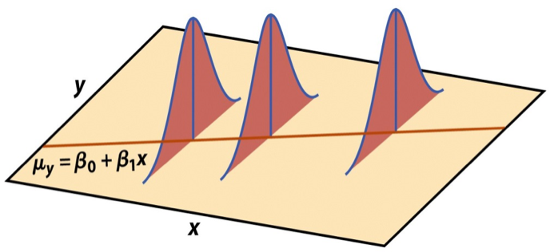

```{r setup}
#| include: false

library(countdown)

knitr::opts_chunk$set(
  fig.width = 8,
  fig.asp = 0.618,
  fig.retina = 3,
  dpi = 300,
  out.width = "80%",
  fig.align = "center"
)

options(scipen=999)
```

## Announcements 

- [HW 02](../hw/hw-02.html) due TODAY at 11:59pm

- [Project proposal](../project.html) due Tuesday, September 29 at 11:59pm (on GitHub)

- [Statistics experience](../hw/hw-stats-experience.html) due November 24

## Exam 01 resources

Exam 01: October 6 in-class

- [Exam 01 practice](../exam-01-practice.html)
- [Math rules](../math-rules.html) (will be provided on exam)
- Lecture recordings
- Prepare readings (see course schedule)
- Lecture notes
- AEs
- Lab and HW assignments

## Topics

- Hypothesis tests for a coefficient $\beta_j$

## Computing setup

```{r packages}
#| echo: true
#| message: false

# load packages
library(tidyverse)  
library(tidymodels)  
library(knitr)       
library(kableExtra)  
library(patchwork)   

# set default theme in ggplot2
ggplot2::theme_set(ggplot2::theme_bw())
```

## Data: NCAA Football expenditures {.midi}

Today's data come from [Equity in Athletics Data Analysis](https://ope.ed.gov/athletics/#/datafile/list) and includes information about sports expenditures and revenues for colleges and universities in the United States. This data set was featured in a [March 2022 Tidy Tuesday](https://github.com/rfordatascience/tidytuesday/blob/master/data/2022/2022-03-29/readme.md).

We will focus on the 2019 - 2020 season expenditures on football for institutions in the NCAA - Division 1 FBS. The variables are :

- `total_exp_m`: Total expenditures on football in the 2019 - 2020 academic year (in millions USD)

- `enrollment_th`: Total student enrollment in the 2019 - 2020 academic year (in thousands)

- `type`: institution type (Public or Private)

```{r}
#| include: false
#| eval: false

## code to make data set for these notes

sports <- readr::read_csv('https://raw.githubusercontent.com/rfordatascience/tidytuesday/master/data/2022/2022-03-29/sports.csv') 

# filter data to only include D1 football for the year 2019

sports |>
  filter(sports == "Football", 
         classification_name == "NCAA Division I-FBS", year == 2019) |>
  mutate(type = if_else(sector_name == "Private nonprofit, 4-year or above", "Private", "Public"), 
         enrollment_th = ef_total_count / 1000,
         total_exp_m = total_exp_menwomen/ 1000000) |>
  select(year, institution_name, city_txt, state_cd, zip_text, type,
         enrollment_th, 
         total_exp_m) |> 
  write_csv("data/ncaa-football-exp.csv")


```

```{r}
football <- read_csv("data/ncaa-football-exp.csv")
```

## Regression model

```{r}
#| echo: true
exp_fit <- lm(total_exp_m ~ enrollment_th + type, data = football)
tidy(exp_fit) |>
  kable(digits = 3)
```

## Assumptions for regression {.midi}

::::: columns
::: {.column width="50%"}
$$
\mathbf{y}|\mathbf{X} \sim N(\mathbf{X}\boldsymbol{\beta}, \sigma^2\mathbf{I})
$$

{fig-align="center"}
:::

::: {.column width="50%"}
1.  **Linearity:** There is a linear relationship between the response and predictor variables.
2.  **Constant Variance:** The variability about the least squares line is generally constant.
3.  **Normality:** The distribution of the residuals is approximately normal.
4.  **Independence:** The residuals are independent from one another.
:::
:::::

## Estimating $\sigma^2$ {.midi}

- Once we fit the model, we can use the residuals to estimate $\sigma^2$

- The estimated value $\hat{\sigma}^2$ is needed for hypothesis testing and constructing confidence intervals for regression

$$
\hat{\sigma}^2 = \frac{SSR}{n - p - 1} = \frac{\mathbf{e}^\mathsf{T}\mathbf{e}}{n-p-1} 
$$

- The **regression standard error** $\hat{\sigma}$ is a measure of the average distance between the observations and regression line

$$
\hat{\sigma} = \sqrt{\frac{SSR}{n - p - 1}} = \sqrt{\frac{\mathbf{e}^\mathsf{T}\mathbf{e}}{n - p - 1}}
$$

## Sampling distribution of $\hat{\beta}$ {.midi}

- A **sampling distribution** is the probability distribution of a statistic for a large number of random samples of size $n$ from a population

- The sampling distribution of $\hat{\boldsymbol{\beta}}$ is the probability distribution of the estimated coefficients if we repeatedly took samples of size $n$ and fit the regression model

$$
\hat{\boldsymbol{\beta}} \sim N(\boldsymbol{\beta}, \sigma^2(\mathbf{X}^\mathsf{T}\mathbf{X})^{-1})
$$

. . .

The estimated coefficients $\hat{\boldsymbol{\beta}}$ are **normally distributed** with

$$
E(\hat{\boldsymbol{\beta}}) = \boldsymbol{\beta} \hspace{10mm} Var(\hat{\boldsymbol{\beta}}) = \sigma^2(\mathbf{X}^\mathsf{T}\mathbf{X})^{-1}
$$

## Sampling distribution of $\hat{\beta}_j$

$$
\hat{\boldsymbol{\beta}} \sim N(\boldsymbol{\beta}, \sigma^2(\mathbf{X}^\mathsf{T}\mathbf{X})^{-1})
$$

Let $\mathbf{C} = (\mathbf{X}^\mathsf{T}\mathbf{X})^{-1}$. Then, for each coefficient $\hat{\beta}_j$,

- $E(\hat{\beta}_j) = \boldsymbol{\beta}_j$, the $j^{th}$ element of $\boldsymbol{\beta}$

- $Var(\hat{\beta}_j) = \sigma^2C_{jj}$

- $Cov(\hat{\beta}_i, \hat{\beta}_j) = \sigma^2C_{ij}$

# Application exercise

::: appex
📋 [sta221-fa26.github.io/ae/ae-02-coefficient-dist.html](../ae/ae-02-coefficient-dist.html)
:::

## Variance-covariance matrix for coefficients

```{r}
X <- model.matrix(total_exp_m ~ enrollment_th + type, 
                  data = football)
sigma_sq <- glance(exp_fit)$sigma^2

var_beta <- sigma_sq * solve(t(X) %*% X)
var_beta
```

## Standard error of coefficients

```{r}
#| echo: false
tidy(exp_fit) |> kable(digits = 3)
```

<br>

```{r}
sqrt(diag(var_beta))
```

# Hypothesis test for $\beta_j$

## Hypothesis testing as a US court trial

- **Null hypothesis**, $H_0$ : Defendant is innocent

- **Alternative hypothesis**, $H_a$ : Defendant is guilty

- **Present the evidence:** Collect data

- **Judge the evidence:** “Could these data plausibly have happened by chance if the null hypothesis were true?”

  - Yes: Fail to reject $H_0$

  - No: Reject $H_0$

## Steps for a hypothesis test

1.  State the null and alternative hypotheses.

2.  Compute a test statistic.

3.  Compute the p-value.

4.  State the conclusion.

## Hypothesis test for $\beta_j$: Hypotheses

We will generally test the hypotheses:

$$
\begin{aligned}
&H_0: \beta_j = 0 \\
&H_a: \beta_j \neq 0
\end{aligned}
$$

::: question
State these hypotheses in words.
:::

## Hypothesis test for $\beta_j$: Test statistic

**Test statistic:** Number of standard errors the estimate is away from the null

$$
\text{Test Statistic} = \frac{\text{Estimate - Null}}{\text{Standard error}} \\
$$

. . .

If $\sigma^2$ was known, the test statistic would be

$$Z = \frac{\hat{\beta}_j - 0}{SE_{\hat{\beta}_j}} ~ = ~\frac{\hat{\beta}_j - 0}{\sqrt{\sigma^2 C_{jj}}} ~\sim ~ N(0, 1)
$$

## Hypothesis test for $\beta_j$: Test statistic

In practice, $\sigma^2$ is [**not**]{.underline} known, so we use $\hat{\sigma}^2$ to estimate $SE_{\hat{\beta}_j}$

$$T = \frac{\hat{\beta}_j - 0}{SE_{\hat{\beta}_j}} ~ = ~\frac{\hat{\beta}_j - 0}{\sqrt{\hat{\sigma}^2 C_{jj}}} ~\sim ~ t_{n-p-1}
$$

. . .

- $T$ follows a $t$ distribution with $n - p -1$ degrees of freedom.

- We need to account for the additional variability introduced by computing $SE_{\hat{\beta}_j}$ using an estimated value instead of a fixed, known value

## *t* vs. N(0,1)

```{r}
#| label: fig-normal-t-curves
#| fig-cap: Standard normal vs. t distributions
#| echo: false

colors <- c("t, df = 2" = "red", 
            "t, df = 5" = "blue",
            "t, df = 10" = "darkgreen", 
            "t, df = 30" = "purple",
            "N(0,1)" = "black")
ggplot() + 
  xlim(-5, 5) + 
  geom_function(fun = dnorm, aes(color = "N(0,1)")) + 
  geom_function(fun = dt,args = list(df = 2), aes(color = "t, df = 2")) +
  geom_function(fun = dt,args = list(df = 5), aes(color = "t, df = 5")) + 
  geom_function(fun = dt,args = list(df = 10), aes(color = "t, df = 10"))  +
  geom_function(fun = dt,args = list(df = 30), aes(color ="t, df = 30")) + 
  scale_color_manual(values = colors, breaks = names(colors)) +
    labs(x = "", y = "", color = "") + 
  theme_bw()
```

## Your turn

::: question
Which test statistic indicates the strongest evidence against the null hypothesis?
:::

{fig-align="center" width="30%"}

<center><https://app.wooclap.com/PXEEUJA></center>

## Hypothesis test for $\beta_j$: p-value

The **p-value** measures how likely it is to see results at least as extreme as the observed result, given the null hypothesis is true.

$$
\text{p-value} = P(|t| > |T|),
$$

calculated from a $t$ distribution with $n- p - 1$ degrees of freedom

. . .

::: question
Why do we take into account the high and low ends of the distribution to define "extreme" for this test?
:::

## Understanding the p-value

| Magnitude of p-value    | Interpretation                        |
|:------------------------|:--------------------------------------|
| p-value \< 0.01         | strong evidence against $H_0$         |
| 0.01 \< p-value \< 0.05 | moderate evidence against $H_0$       |
| 0.05 \< p-value \< 0.1  | weak evidence against $H_0$           |
| p-value \> 0.1          | effectively no evidence against $H_0$ |

<br>

**These are general guidelines. The strength of evidence depends on the context of the problem.**

## Hypothesis test for $\beta_j$: Conclusion

**There are two parts to the conclusion**

- Make a conclusion by comparing the p-value to a predetermined decision-making threshold called the significance level ( $\alpha$ level)

  - If $\text{p-value} < \alpha$: Reject $H_0$

  - If $\text{p-value} \geq \alpha$: Fail to reject $H_0$

- State the conclusion in the context of the data

## Your turn  {.midi}

```{r}
#| echo: false

tidy(exp_fit) |>
  kable(digits = 3)
```

:::: question
::: midi
We wish to test whether there is evidence of a linear relationship between enrollment and football expenditure after accounting for the type of institution.

1.  State the null and alternative hypotheses in words and mathematical notation.
2.  State how the test statistic is computed from the other values in the output. Interpret the test statistic in the context of the data.
3.  State the distribution used to compute the p-value and interpret it in the context of the data.
4.  State your conclusion in the context of the data.
:::
::::

## Recap

- Conducted a hypothesis test for a coefficient $\beta_j$

## Before next class

- HW 02 due today at 11:59pm

- Complete [Lecture 11 prepare](../prepare/prepare-lec11.html)
