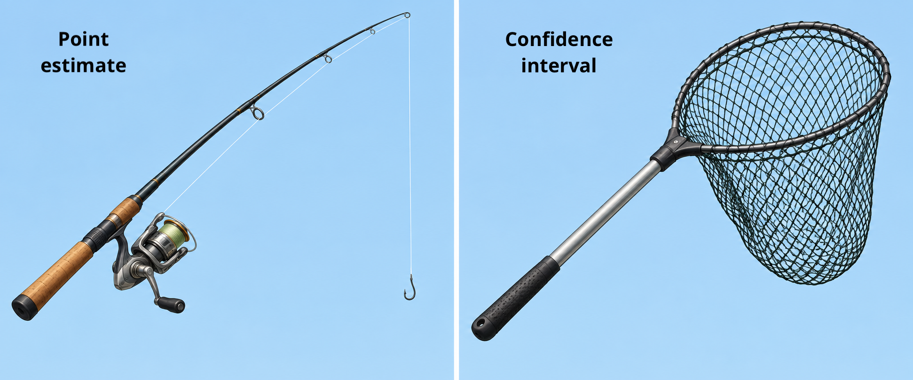

```{r setup}
#| include: false

library(countdown)

knitr::opts_chunk$set(
  fig.width = 8,
  fig.asp = 0.618,
  fig.retina = 3,
  dpi = 300,
  out.width = "80%",
  fig.align = "center"
)

options(scipen=999)
```

## Announcements

- [Project proposal](../project.html) due TODAY at 11:59pm (on GitHub)

- [HW 03](../hw/hw-03.html) due Thursday, October 1 at 11:59pm

- Exam 01 on Tuesday, October 6 in-class

- [Statistics experience](../hw/hw-stats-experience) due Tuesday, November 24

  - Survey link updated in instructions

## Topics

- Confidence interval for a coefficient $\beta_j$

## Computing setup

```{r packages}
#| echo: true
#| message: false

# load packages
library(tidyverse)  
library(tidymodels)  
library(knitr)       
library(kableExtra)  
library(patchwork)   

# set default theme in ggplot2
ggplot2::theme_set(ggplot2::theme_bw())
```

## Data: NCAA Football expenditures {.midi}

```{r}
football <- read_csv("data/ncaa-football-exp.csv")
```

Today's data come from [Equity in Athletics Data Analysis](https://ope.ed.gov/athletics/#/datafile/list) and includes information about sports expenditures and revenues for colleges and universities in the United States. This data set was featured in a [March 2022 Tidy Tuesday](https://github.com/rfordatascience/tidytuesday/blob/master/data/2022/2022-03-29/readme.md).

We will focus on the 2019 - 2020 season expenditures on football for `r nrow(football)` institutions in the NCAA - Division 1 FBS. The variables are

- `total_exp_m`: Total expenditures on football in the 2019 - 2020 academic year (in millions USD)

- `enrollment_th`: Total student enrollment in the 2019 - 2020 academic year (in thousands)

- `type`: institution type (Public or Private)

```{r}
#| include: false
#| eval: false

## code to make data set for these notes

sports <- readr::read_csv('https://raw.githubusercontent.com/rfordatascience/tidytuesday/master/data/2022/2022-03-29/sports.csv') 

# filter data to only include D1 football for the year 2019

sports |>
  filter(sports == "Football", 
         classification_name == "NCAA Division I-FBS", year == 2019) |>
  mutate(type = if_else(sector_name == "Private nonprofit, 4-year or above", "Private", "Public"), 
         enrollment_th = ef_total_count / 1000,
         total_exp_m = total_exp_menwomen/ 1000000) |>
  select(year, institution_name, city_txt, state_cd, zip_text, type,
         enrollment_th, 
         total_exp_m) |> 
  write_csv("data/ncaa-football-exp.csv")


```

## Regression model

```{r}
#| echo: true
exp_fit <- lm(total_exp_m ~ enrollment_th + type, data = football)
tidy(exp_fit) |>
  kable(digits = 3)
```

## Steps for a hypothesis test

1.  State the null and alternative hypotheses.
2.  Compute a test statistic.
3.  Compute the p-value.
4.  State the conclusion.

## Hypothesis test for $\beta_\text{public}$

```{r}
#| echo: false

tidy(exp_fit) |>
  kable(digits = 3)
```

# Confidence interval for $\beta_j$

## Confidence interval for $\beta_j$ {.midi}

::: incremental
- A plausible range of values for a population parameter is called a **confidence interval**

- Using only a single point estimate is like fishing with a fishing line, and using a confidence interval is like fishing with a net

  - We put the line where we saw a fish but we will probably miss, if we use a net in that area, we have a good chance of catching the fish
:::

{fig-align="center"}

## Confidence interval for $\beta_j$ 



Similarly, if we report a point estimate, we probably will not hit the exact population parameter, but if we report a range of plausible values we have a good shot at capturing the parameter

## What "confidence" means {.midi}

::: incremental
- We will construct $C\%$ confidence intervals.

  - The confidence level impacts the width of the interval

- "Confident" means if we were to take repeated samples of the same size as our data, fit regression lines using the same predictors, and calculate $C\%$ CIs for the coefficient of $x_j$, then $C\%$ of those intervals will contain the true value of the coefficient $\beta_j$

- Balance precision and accuracy when selecting a confidence level
:::

## Your turn

::: question
What is the probability $\beta_j$ is in the 95% confidence interval

- pre data collection?
- post data collection?
:::

{fig-align="center" width="30%"}

::: center
[`https://app.wooclap.com/GFGFXBZ`{=html}](https://app.wooclap.com/GFGFXBZ)
:::

## Confidence interval for $\beta_j$

$$
\text{Estimate} \pm \text{ (critical value) } \times \text{SE}
$$

. . .

$$
\hat{\beta}_1 \pm t^* \times SE_{\hat{\beta}_j}
$$

where $t^*$ is calculated from a $t$ distribution with $n-p-1$ degrees of freedom

## Confidence interval: Critical value

::: {.fragment fragment-index="1"}
```{r}
#| echo: true

# confidence level: 95%
qt(0.975, df = nrow(football) - 2 - 1)
```
:::

<br>

::: {.fragment fragment-index="2"}
```{r}
# confidence level: 90%
qt(0.95, df = nrow(football) - 2 - 1)
```
:::

<br>

::: {.fragment fragment-index="3"}
```{r}
# confidence level: 99%
qt(0.995, df = nrow(football) - 2 - 1)
```
:::

## 95% CI for $\beta_\text{enroll}$: Calculation

```{r}
#| echo: false
tidy(exp_fit) |> 
  kable(digits = 3)
```

## 95% CI for $\beta_j$ in R

```{r}
#| echo: true

tidy(exp_fit, conf.int = TRUE, conf.level = 0.95) |> 
  kable(digits = 3)
```

**Interpretation**: We are 95% confident that for each additional 1,000 students enrolled, the institution's expenditures on football will be greater by \$562,000 to \$999,000, on average, holding institution type constant.

## Confidence intervals & hypothesis tests {.midi}

- A $C\%$ confidence interval corresponds to a two-sided hypothesis test with $\alpha$-level of $(100 - C)\%$

- Using a confidence interval for a two-sided test:

  - If the hypothesized value is in the interval $\Rightarrow$ Fail to reject $H_0$

  - If the hypothesized value is not in the interval $\Rightarrow$ Reject $H_0$

<br>

::: question
The 95% confidence interval for `typePublic` is -19.466 to -6.986. Do we reject or fail to reject the null hypothesis that $\beta_{\text{typePublic}} = 0$ ?
:::

## Recap

- Constructed and interpreted a confidence interval for a coefficient $\beta_j$

## Before next class

- Complete project proposal (submit by pushing to GitHub repo)

- No prepare assignment
