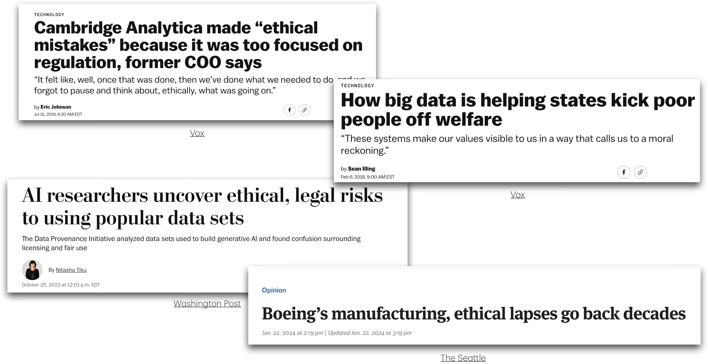
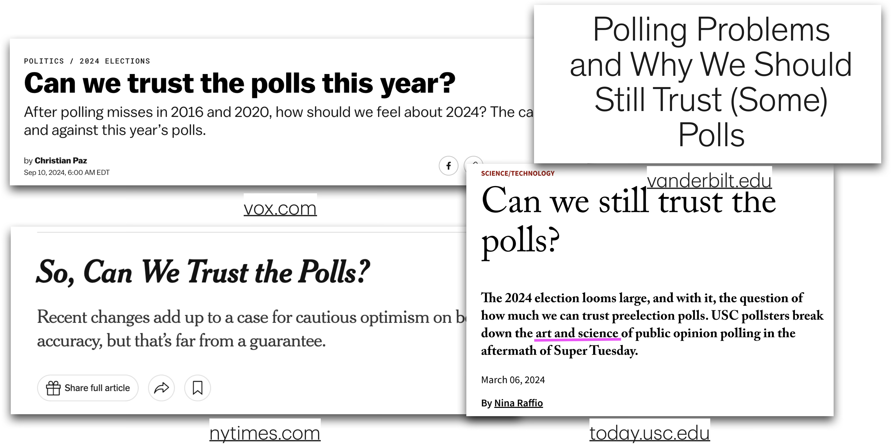
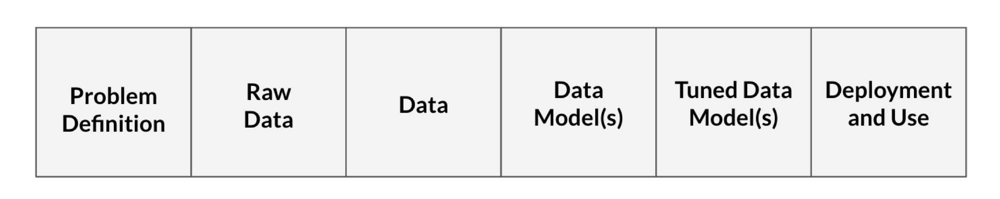
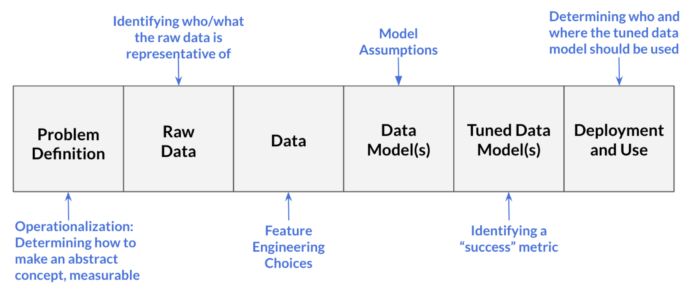
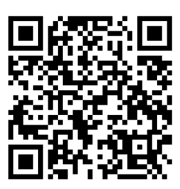

```{r setup, include=FALSE, echo=FALSE}
options(htmltools.dir.version = FALSE)
knitr::opts_chunk$set(
	fig.align = "center",
	fig.height =5,
	fig.width = 8,
	message = FALSE,
	warning = FALSE
)
```

## Announcements

- SSMU Data Challenge - October 17. See [Ed Discussion](https://edstem.org/us/courses/101204/discussion/8366022) for details

- New 4+1 program in StatSci - Info Session October 14. See [Ed Discussion](https://edstem.org/us/courses/101204/discussion/8368174) for details.

<br>

<center>🍂Have a good fall break!🍂</center>

## Topics

- Data science ethics

# Data science ethics

## When things go wrong



## Branding healthy foods

:::::: columns
:::: {.column width="50%"}
::: midi
- The now retracted paper ["Can Branding Improve School Lunches"](https://jamanetwork.com/journals/jamapediatrics/fullarticle/1352169) concluded that giving healthy food snappy names and colorful branding would lead to more kids eating healthy foods. [@goltz2023real]

- Millions of dollars in government funding went towards the Smarter Lunchrooms Movement and the program was adopted in 30,000 schools in the US. [@lee2017smarterlunchrooms]
:::
::::

::: {.column width="50%"}
](images/clipboard-1465839102.png){width="60%"}
:::
::::::

## Branding healthy foods

- In the [notice of retraction](https://jamanetwork.com/journals/jamapediatrics/fullarticle/2654849), the authors state some of the errors included

  > "...we inadvertently provided an incorrect description of the study design and sample size, used an inadequate statistical procedure, and presented a mislabeled bar graph."

- This was part of a pattern of misleading data and statistical analyses published by this lab.

## Gap in public trust



------------------------------------------------------------------------

<br>

<br>

<br>

"…coverage of polls \[data science\] often **does not adequately convey the many decisions** that pollsters \[data scientists\] must make … as well as the **potential consequences of those decisions**”

::: aside
Clinton, J. (2021, January 11). Polling problems and why we should still trust (some) polls. The Vanderbilt Project on Unity and American Democracy. <https://www.vanderbilt.edu/unity/2021/01/11/polling-problems-and-why-we-should-still-trust-some-polls/>
:::

------------------------------------------------------------------------

## "Ideal objectivity?"

::: incremental
- **Desire for “ideal objectivity”**

  - Work that is free from interference of human perception [@feinberg2023myth]

  - Conclusions that are observer independent [@gelman2017beyond]

- **Feels like the ethical approach** [@feinberg2023myth]

- **There are implications** [@feinberg2023myth]

  - Distorted reality of data analysis process

  - Lack of communication about decisions that don’t seem “objective”
:::

## The role of data science ethics

- Illuminates the the decision-making in data science

  - Makes explicit the existence of choice throughout an analysis

  - Makes explicit the moral implications of our choices

- Align data science practices with what we ought to do and moral duties to stakeholders

::: aside
Source: @colando2024philosophy
:::

## Processes in data science {.midi}

{fig-align="center"}

- **Problem definition**: Question we wish to answer with data
  - What is the likelihood a customer purchases product S?
  - Our model (built on training data) is successful if it achieves at least 75% accuracy on testing data

::: question
What choice(s) have been made at this step?
:::

::: aside
Source: @colando2024philosophy
:::

## Processes in data science {.midi}

{alt="Source: Figure 1 of @colando2024philosophy" fig-align="center"}

- **Raw data**: Information collected by interacting with the world
  - Information from each time the customer clicks on an advertisement for product S
  - Includes timestamps for each advertisement interaction and the customer’s demographic information

::: question
What choice(s) have been made at this step?
:::

::: aside
Source: @colando2024philosophy
:::

## Processes in data science {.midi}

{alt="Source: Figure 1 of @colando2024philosophy" fig-align="center"}

- **Data**: Processed form of raw data
  - Data table where each row represents a unique customer and the columns are the variables that describe that customer
  - Includes information from raw data and engineered variables (e.g., average time between clicks)
  - We decide what to do with missing data

::: question
What choice(s) have been made at this step?
:::

::: aside
Source: @colando2024philosophy
:::

## Processes in data science {.midi}

{alt="Source: Figure 1 of @colando2024philosophy" fig-align="center"}

- **Data model(s)**: Product from running input data through learning algorithm (generalize the relationship between variables in the data)
  - We choose a logistic regression model of the form

$$
\log(\frac{\pi}{1-\pi}) = \beta_0 + \beta_1 ~ \text{age} 
+ \beta_2 ~ \text{number clicks}
 + \beta_3 ~ \text{avg time between clicks}
$$

::: question
What choice(s) have been made at this step?
:::

::: aside
Source: @colando2024philosophy
:::

## Processes in data science {.midi}

{alt="Source: Figure 1 of @colando2024philosophy" fig-align="center"}

- **Tuned data model(s)**: Data model in which the parameters are adjusted
  - Use 5-fold cross validation to determine which variables to include in order to improve model's accuracy

::: question
What choice(s) have been made at this step?
:::

::: aside
Source: @colando2024philosophy
:::

## Processes in data science {.midi}

{alt="Source: Figure 1 of @colando2024philosophy" fig-align="center"}

- **Deployment and usage**: Generating predictions (or other output) from the tuned model
  - Determine that the model should only be used for customers under a certain age
  - Determine only data scientists at the company selling product S should be able to access model and sell products from it

::: question
What choice(s) have been made at this step?
:::

::: aside
Source: @colando2024philosophy
:::

## Your data science process {.midi}

{width="90%"}

## What is data science ethics?

Data science ethics studies and evaluates moral problems related to:

- **Data:** generation, recording, process, dissemination, and sharing

- **Algorithms:** artificial intelligence, machine learning, large language models, and statistical learning models

- **Corresponding practices:** responsible innovation, programming, hacking, professional code

::: aside
Sources: @colando2024philosophy, @floridi2016data
:::

## Your turn

::: question
What is one ethical concern data scientists need to consider in their work?
:::

{fig-align="center" width="40%"}

::: center
<https://app.wooclap.com/ARZFHPT>
:::

## Data Science Oath {.midi}

1.  I will not be ashamed to say, “I know not,” nor will I fail to call in my colleagues when the skills of another are needed for solving a problem.

2.  I will respect the privacy of my data subjects, for their data are not disclosed to me that the world may know, so I will tread with care in matters of privacy and security.

3.  I will remember that my data are not just numbers without meaning or context, but represent real people and situations, and that my work may lead to unintended societal consequences, such as inequality, poverty, and disparities due to algorithmic bias.

<small>From @nas2018data_science_undergraduate_project based on the Hippocratic Oath for physicians.</small>

## Responsibility {.midi}

The data scientist is (morally) responsible for

- How the data are handled and stored
- Modeling decisions
- Implications of data handling and modeling
- Providing clear documentation and guidance on model use

. . .

The user is (morally) responsible for

- Understanding the model and its limitations
- How the model is deployed

::: aside
Source: @colando2024philosophy
:::

## Example: Mistaken identity {.midi}

Angela Lipps, from Tennessee, spent 5 months in jail after facial recognition software connected her to a string of bank fraud cases in Fargo, North Dakota

- Police were investigating a string of cases in Fargo, ND in which a woman used a fake ID to withdraw money from a bank account or home-equity line of credit
- Investigators used facial recognition technology to identify a potential suspect based on bank surveillance video
- The software "identified a potential suspect with similar features to Angela Lipps"

::: aside
Source: [New York Times](https://www.nytimes.com/2026/03/30/us/north-dakota-facial-recognition-ai-errors-bank-fraud.html)
:::

## Example: Mistaken identity {.midi}

- Police used Angela Lipps' Facebook and Instagram accounts, along with her Tennessee ID to determine she matched the identified suspect
- She was released from jail after a judge dismissed the case

::: aside
Source: [New York Times](https://www.nytimes.com/2026/03/30/us/north-dakota-facial-recognition-ai-errors-bank-fraud.html)
:::

## Example: Mistaken identity {.midi}

- Facial recognition company, Clearview AI uses "publicly available images" for its data base and to train its models used by law enforcement agencies

- Their statement on how models should be used:

  > "Once a search is performed, the search may return a set of potential leads, which the investigator is required to independently verify by both peer review and other means, before continuing with their investigation."

- Website reports "99% accuracy for all demographics"

::: aside
Source: <https://www.clearview.ai/>
:::

## Example: Mistaken identity

::: question
- What are the ethical considerations and responsibilities for the data scientists [building]{.underline} such facial recognition technology?
:::

<br>

::: question
- What are the ethical considerations and responsibilities for those [using]{.underline} such facial recognition technology?
:::

## Example case study

A data analyst received permission to analyze a data set that was scraped from a social media site. The full data set included name, screen name, email address, geographic location, IP (internet protocol) address, demographic profiles, and preferences for relationships.

<br>

::: question
What are ethical considerations of putting a deidentified data set with name and email address removed in a LLM (e.g., Claude or ChatGPT) to help with analysis?
:::

::: aside
Adapted from Chapter 8 of @baumer2017modern
:::

## Common ethical pitfalls

- **p-hacking**: Manipulating the data to derive a statistical significant p-value where one is absent [@goltz2023real]

  - [xkcd comic](https://xkcd.com/882/)

- **HARK-ing**: Hypothesizing after Experimental Results are Known. The results are know, and then a hypothesis is constructed to explain the observed data [@goltz2023real]

<center>**A result of "not statistically significant" can be just as interesting and meaningful as a statistically significant result.**</center>

## p-hacking pizza studies

The following now retracted papers were published about consumer behaviors at a pizza restaurant:

- "Lower buffet prices lead to less taste satisfaction"

- "Peak-end pizza: Prices delay evaluations of quality"

- "Eating heavily: Men eat more in the company of women."

- "Low prices and high regret: How pricing influences regret at all-you-can-eat buffets."

## p-hacking pizza studies

::: midi
The lead researcher on the papers published the following about the analysis process on his personal blog:

> "I gave her \[post-doc researcher\] a data set of a self-funded, failed study which had null results (it was a one month study in an all-you-can-eat Italian restaurant buffet where we had charged some people 1/2 as much as others). I said, 'This cost us a lot of time and our own money to collect. There's got to be something here we can salvage because it's a cool (rich & unique) data set.' I had three ideas for potential Plan B, C, & D directions (since Plan A had failed)."
:::

::: question
What are the ethical concerns with this analysis approach?
:::

## p-hacking pizza results

::: midi
Researchers attempted to reproduce the results, and published the following inconsistencies:

- impossible sample sizes within and between articles
- incorrectly calculated and/or reported test statistics and degrees of freedom,
- large number of impossible means and standard deviations.

"In total, we identified approximately 150 inconsistencies and impossibilities in these four papers. Taken together, these problems make it difficult to have confidence in the authors’ conclusions."
:::

::: midi
Source: [@van2017statistical]
:::

## Why reproducibility matters

::: midi
“One of the fundamental principles of the scientific method is transparency - to conduct research in a way that can be assessed, verified, and reproduced. This is not optional - it is imperative.” - Tim van der Zee in @lee2017smarterlunchrooms

- Reproducibility provides scientists with evidence that research results are objective and reliable and not due to bias or chance [@resnik2016]

- Irreproducibility, by contrast, may indicate a problem with any of the steps involved in the research [@resnik2016]

- Check your models: [Machine Learning Reproducibility Checklist](https://www.cs.mcgill.ca/~jpineau/ReproducibilityChecklist.pdf)
:::

## Additional resources

- [American Statistical Association: Ethical Guidelines for Statistical Practice](https://www.amstat.org/your-career/ethical-guidelines-for-statistical-practice)

- [Data science ethics reading lists](https://scolando.github.io/data-science-ethics/Reading-Tags.html)

- [Chapter 8 in Modern Data Science with R](https://mdsr-book.github.io/mdsr3e/08-ethics.html#sec-ethics-intro)

## Examples in slides

- When things go wrong examples:

  - [Cambridge Analytica made 'ethical mistakes' because it was too focused on regulation, former COO says](https://www.vox.com/recode/2019/7/31/20747874/cambridge-analytica-julian-wheatland-great-hack-netflix-documentary-kara-swisher-podcast-interview) from Vox.com

  - [How big data is helping states kick poor people off welfare](https://www.vox.com/2018/2/6/16874782/welfare-big-data-technology-poverty) from Vox.com

  - [How AI researchers uncover ethical, legal risks to using popular data sets](https://www.washingtonpost.com/technology/2023/10/25/data-provenance/) from the Washington Post

  - [Boeing's manufacturing, ethical lapses go back decades](https://www.seattletimes.com/opinion/boeings-manufacturing-ethical-lapses-go-back-decades/) from the Seattle Times

## Examples in slides

- Gap in public trust examples

  - [Can we trust the polls this year?](https://www.vox.com/2024-elections/370649/trust-polls-2016-2020-election-2024-pollster-polling-miss) from Vox.com

  - [Polling problems and why we should still trust (some) polls](https://www.vanderbilt.edu/unity/2021/01/11/polling-problems-and-why-we-should-still-trust-some-polls/) from Vanderbilt Project on Unity and American Democracy

  - [So, can we trust the polls?](https://www.nytimes.com/2024/11/01/upshot/so-can-we-trust-the-polls.html) from New York Times

  - [Can we still trust the polls?](https://today.usc.edu/can-we-still-trust-the-polls/) from University of Southern California

## Recap

- Data science ethics

## Before next class

🍂 Enjoy Fall Break 🍂

## References
